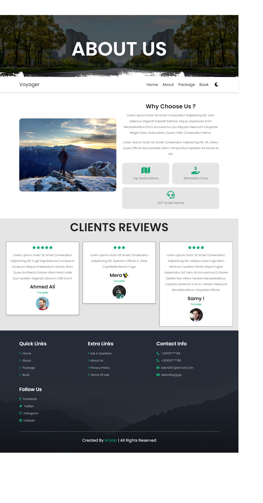

# Voyager

**Voyager** is a travel site that offers trips, tours, and camps and helps you book for incredible adventures. The site design is _interactive, attractive, and responsive_ to offer the best experience for any screen size.

## Table of Contents

- [Features](#Features)
- [Technologies](#Technologies)
- [Project video](#video)
- [Screenshots](#Screenshots)

## Features

- **Simple & attractive user interface.**
- **Responsive site design.**
- **Light / Dark mode.**
- **Use of browser local storage**
- **The booking form is connected to MySQL database to store data.**

## Technologies

- **HTML / CSS / JavaScript**
- **PHP**
- **MYSQL**
- **GIT & Github**
- **[SwiperJs](https://swiperjs.com/)**

## Video

<iframe width="560" height="315" src="https://www.youtube-nocookie.com/embed/LdzW3azkwEw?si=WkcqenBTHdGp2d1R" title="YouTube video player" frameborder="0" allow="accelerometer; autoplay; clipboard-write; encrypted-media; gyroscope; picture-in-picture; web-share" allowfullscreen></iframe>

## Screenshots

